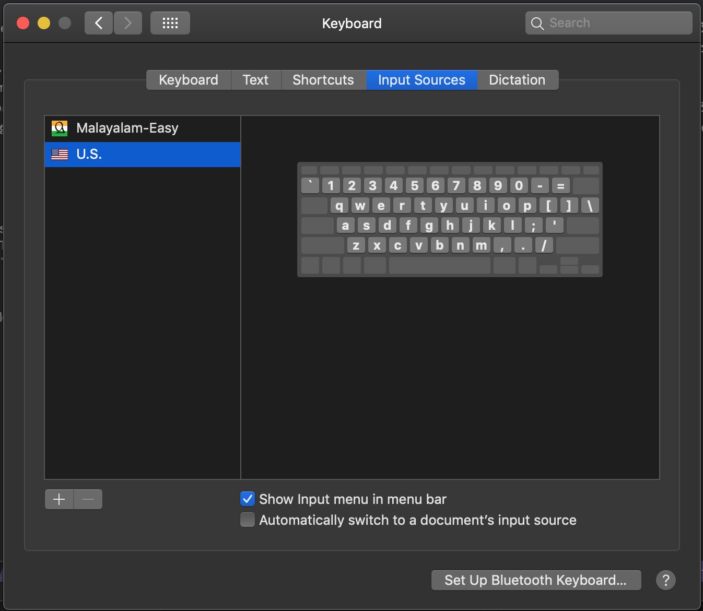
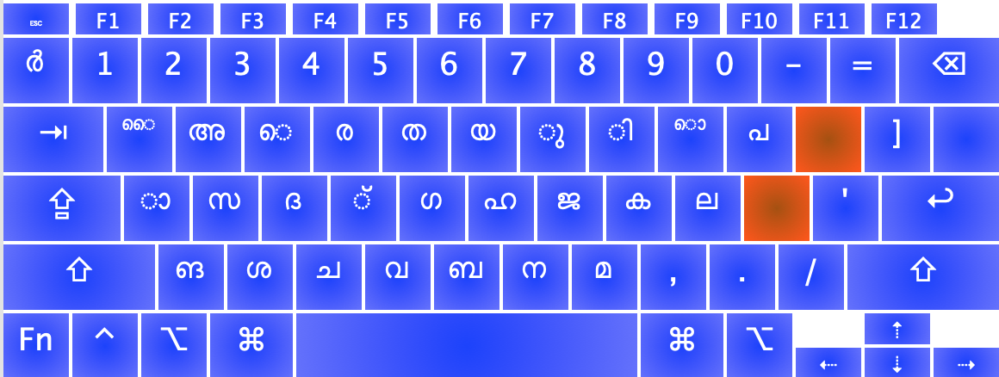
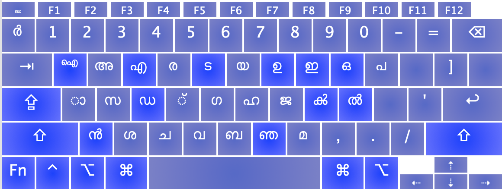

- [Malayalam Easy Keyboard for macOSX.](#orgcb512ad)
  - [What is Malayalam Easy Keyboard](#org48ff422)
  - [Installing Malayalam Easy Keyboard in macOSX](#org3bb31de)
- [Malayalam Keyboard Mapping.](#org45e4469)

# Malayalam Easy Keyboard for macOSX.

കമ്പ്യൂട്ടറിൽ മലയാളത്തിൽ ടൈപ് ചെയ്യാൻ പരമ്പരാഗതമായി രണ്ട് സങ്കേതങ്ങളാണ് ഉള്ളത്

1.  ട്രാൻസ്ലിറ്ററേഷൻ സങ്കേതം.
2.  ഇൻസ്ക്രിപ്റ്റ് സങ്കേതം

ഇവ രണ്ടിനും ഗുണങ്ങളും ദോഷങ്ങളുമുണ്ട്. മലയാളം സംസാരിക്കാനറിയാവുന്നവന് എളുപ്പത്തിൽ പഠിച്ചെടുക്കാവുന്നതാണ് ട്രാൻസ്ലിറ്ററേഷൻ സങ്കേതം. ട്രാൻസ്ലിറ്ററേഷൻ ഇംഗ്ലീഷ് അക്ഷരക്കൂട്ടുകളുടെ രൂപസംബന്ധങ്ങൾ മനസ്സിലാക്കി അവയ്ക്കു തുല്യമായ മലയാള അക്ഷരങ്ങൾ കണ്ടെത്തുന്ന രീതിയാണ് അവലംബിക്കുന്നത്. ഉദാഹരണത്തിന് "ക്ഷ" എന്നെഴുതണമെങ്കിൽ, ഇംഗ്ലീഷിൽ "ksha" എന്നെഴുതണം. ചില സന്ദർഭങ്ങളിൽ ചെറിയക്ഷരങ്ങളും, വലിയക്ഷരങ്ങളും കൂട്ടി വേണം എഴുതാൻ.

ഇൻസ്ക്രിപ്റ്റ് മലയാളം ടൈപ്പിങ് സങ്കേതം, ഇൻഡ്യാ ഗവണ്മെന്റ് നിശ്ചയിച്ച ഒരു സ്റ്റാൻഡാർഡ് പ്രകാരം ഉണ്ടാക്കിയതാണ്. 1986 ൽ നിലവിൽ വന്ന ഈ സ്റ്റാൻഡാർഡ് ആണ് പരമ്പരാഗതമായി ടൈപ്റൈറ്ററിലുമൊക്കെ ഉപയോഗിച്ച് വന്നത്. കമ്പ്യൂട്ടറുകൾ പ്രചാരത്തിലായതോടെ അവ കമ്പ്യൂട്ടറുകളിലേയ്ക്കും സ്വീകരിക്കപ്പെട്ടു. Windows 2000, തൊട്ടും മാക് ഓ.എസ്സിന്റെ എൽ കാപ്പിറ്റാൻ പതിപ്പു തൊട്ടും മലയാളം ഇൻഡിക് കീബോർഡുകൾ പ്രമുഖ ഓപ്പറേറ്റിങ് സിസ്റ്റങ്ങളിൽ സന്നിവേശിപ്പിച്ചു തുടങ്ങി. അതോടെ ഇൻസ്ക്രിപ്റ്റ് കീബോർഡുകൾക്ക് പ്രചുരപ്രചാരം ലഭിച്ചു തുടങ്ങി. ഇന്ന് iOS ലും Android ലും ഇൻസ്ക്രപ്റ്റ് കീബോർഡുകൾ പാക്കേജ് ചെയ്ത് വരുന്നുണ്ട്.

## What is Malayalam Easy Keyboard

ഈസി കീബോർഡ് ട്രാൻസ്ലിറ്ററേഷന്റെയും ഇൻസ്ക്രിപ്റ്റിന്റെയും ഒരു സങ്കരമാണെന്ന് പറയാം. മലയാള അക്ഷരങ്ങളുമായി ഉച്ചാരണ സാമ്യമുള്ള ഇംഗ്ലീഷ് അക്ഷരങ്ങൾ മാപ് ചെയ്ത് വികസിപ്പിച്ചതാണ് മലയാളം-ഈസി കീബോർഡ്.

1.  മലയാളം വ്യഞ്ജനാക്ഷരങ്ങൾ ആണ് കൂടുതലായി ടൈപ് ചെയ്യണ്ടി വരുക. അതിനാൽ അവ കീ മോഡിഫൈയേഴ്സ് ഇല്ലാതെ സാധാരണ QWERTY സ്കീമിലേയ്ക്ക് മാപ് ചെയ്തിരിക്കുന്നു. വ്യജ്ഞനങ്ങളുടെ ഇരട്ടിപ്പുകൾ shift അമർത്തിയാൽ ലഭിക്കുന്ന രീതിയിൽ ക്രമീകരിച്ചിരിക്കുന്നു. ഉദാ: k അമർത്തിയാൽ ക എന്ന വ്യഞ്ജനം ലഭിക്കും. shift അമർത്തി K ഞെക്കിയാൽ ഖ ലഭിക്കും.
2.  അക്കങ്ങൾ മാപ് ചെയ്തിട്ടില്ല. അതിനാൽ ഇംഗ്ലീഷ് അക്കങ്ങൾ മലയാളത്തോടൊപ്പം ഉപയോഗിക്കാം.
3.  കണ്ട്രോളും, ആൾട്ടും ഒന്നും അമർത്താതെ വള്ളി കളുടെ അക്ഷരസ്വരങ്ങളിലേയ്ക്കും, ൽ, ൾ, ൺ തുടങ്ങിയ ആറ്റോമിക് ചില്ലുകളും ടൈപ് ചെയ്യാൻ ഡെഡ് കീകൾ ഉപയോഗിക്കാം. ഉദാഹരണത്തിന്, ; ടൈപ് ചെയ്തതിനു ശേഷം l അമർത്തിയാൽ ൽ ലഭിക്കും. l തനിയെ ടൈപ് ചെയ്താൽ ലഭിക്കുന്നത് ല ആണ്.
4.  CTRL കീ മോഡിഫൈയറായി ഉപയോഗിക്കുന്നില്ലാത്തതിനാൽ ഇമാക്സ് പോലുള്ള എഡിറ്ററുകളിലും ഈ

## Installing Malayalam Easy Keyboard in macOSX

-   Clone or download this Repository
-   Locate \`Malayalam-Easy.bundle\` file in the \`src\` directory.
-   Copy \`Malayalam-Easy.bundle\` to \`~/Library/Keyboard Layouts\`
-   Restart the computer.

ഇത്രയും ചെയ്യുന്നതോടെ ഇൻസ്റ്റലേഷൻ തീർന്നു.

അടുത്തത് കീബോർഡ് macOSX ന്റെ മെനു ബാറിലേയ്ക്ക് ചേർക്കുക എന്നതാണ്. അതിനായി

-   Open Keyboard Preferences from System Preferences
    
    

-   Press the + button at the bottom to add a new Keyboard and choose \`Malayalam\` from the list
    
    

-   Select Malayalam-Easy from the available Malayalam Keyboards. Malayalam-Easy will be added to the list. Leave the \`Show Input in the Menubar\` checked.
    
    

ഇപ്പോൾ മെനുബാറിൽ മലയാളം ഇൻപുട് ലഭ്യമായിരിക്കും. മെനുബാർ ക്ലിക് ചെയ്ത് മലയാളം-ഈസി സെലെക്ട് ചെയ്ത് ടൈപ് ചെയ്ത് തുടങ്ങാം.

# Malayalam Keyboard Mapping.

Unshifted keyboard

Shifted Keyboard

Semicolon deadkey. Type \`;\` first. Then type the character

Open Square bracket deadkey. Type \`[\` first. Then type the character
